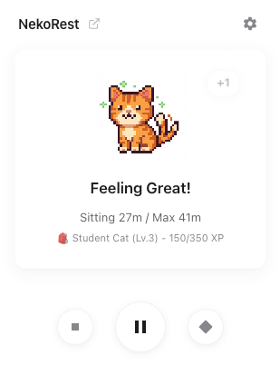
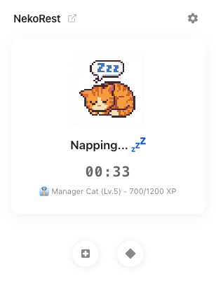

# NekoRest - Cat Focus Timer

  

English | [中文文档](./README_CN.md)

## 🐱 Introduction

**NekoRest** is a pixel-art style virtual pet extension for Chrome.

It's not just a Pomodoro timer, but a living cat companion. When you focus on your work, the cat stays happy and keeps you company; but if you sit for too long without a break, the cat will get sick, or even have an "out-of-body experience" to protest!

Reminding you to stay healthy in the cutest way possible.

 

## ✨ Features

*   **🧘 Smart Idle Detection**:
    *   Uses the Chrome Idle API to intelligently detect your activity status.
    *   **Auto Reset**: When you leave your computer (lock screen or idle) for a set duration (default 5 mins), the timer resets automatically.
    *   No manual operation needed, it guards you silently in the background.
*   **🎮 RPG Level System**:
    *   **XP Growth**: Gain XP every 10 minutes of healthy work, and get bonus rewards for completing rest goals.
    *   **Cat Evolution**: Evolve from "Egg Cat" all the way to "God Cat", unlocking 9 different rank titles.
    *   **Sickness Penalty**: Sitting too long deducts XP, and "cheating" (forced reset) also incurs a penalty!
*   **🎨 Rich Status Feedback**:
    *   **Happy**: Working time is within the safe range.
    *   **Anxious**: Approaching the sitting limit (70%).
    *   **Sick**: Exceeded the limit, the cat falls down.
    *   **Soul**: Severely exceeded (over 1 hour), the cat's soul leaves its body!
    *   **Sleep Mode**: Click the coffee cup to enter a countdown rest mode, the cat will sleep and snore.
*   **🌍 Bilingual Support (i18n)**:
    *   Supports **English** and **Simplified Chinese**.
    *   Switch interface language instantly.
*   **☯️ Zen Mode**:
    *   Click the cat or toggle the switch to hide all text UI, keeping only a minimalist pixel progress bar for an immersive focus experience.

## 📦 Installation

### Chrome Web Store (Recommended)
> Under review, Chrome Web Store link coming soon...

### Developer Mode (Manual)
1. Download the latest `nekorest-v1.0.x.zip` release and unzip it.
2. Open Chrome and visit `chrome://extensions/`.
3. Toggle **"Developer mode"** in the top right corner.
4. Click **"Load unpacked"** in the top left.
5. Select the unzipped folder.

## ⚙️ Recommended Settings

For the best "Pomodoro" experience, we recommend:

*   **Focus Duration**: 45 minutes (Rest once every 45 mins of focus)
*   **Rest Duration**: 5 minutes (Leaving the computer for 5 mins counts as a completed break)

## 🛠️ Development

This project is built with native JavaScript/HTML/CSS, with no complex build process.

### Directory Structure
```text
/
├── manifest.json      # Extension Config (MV3)
├── background.js      # Background Service (State management, Core logic)
├── popup.html/js      # Popup UI (Interaction, Animation)
├── options.html/js    # Settings Page
├── locales.js         # i18n Resources
├── styles.css         # Global Styles
└── icons/             # Icon Assets
```

### Debugging
*   **Popup**: Right-click the extension icon -> "Inspect popup".
*   **Background**: Click "Service Worker" in the extensions management page to view background logs.

## 📝 Changelog

*   **v1.0.6**: Optimized language switching experience, UI polish.
*   **v1.0.4**: Added inline language switching in Popup, fixed duplicate load bugs.
*   **v1.0.0**: Initial release with full idle detection and XP system.

## 📄 License

MIT License. Fork and PR welcome!
